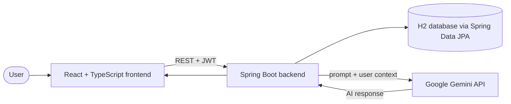

# TimeForge

**An AI-powered study and productivity platform for students.** Plan your syllabus, timetable, tasks and exams in one place, and get AI-generated explanations and study guidance based on your own data.


---

## What it does

- **Study management:** organize subjects, syllabus modules, assignments and exams.
- **Timetables and tasks:** create schedules and track completion from a single dashboard.
- **AI study assistant:** the backend sends your syllabus, pending tasks and exam data to the Google Gemini API and returns summaries, explanations and personalized study guidance.
- **Secure accounts:** JWT-based authentication with Spring Security protects every API route.
- **Persistent data:** all records are stored through the backend, replacing the earlier client-only storage.

## Architecture



1. The user interacts with the React frontend.
2. The frontend calls the Spring Boot REST APIs with a JWT.
3. Spring Security validates the token before any protected request runs.
4. The backend reads and writes tasks, timetables, syllabus and exams through Spring Data JPA.
5. For AI features, the backend builds a prompt from the user's data and calls the Gemini API. The API key stays on the server and is never exposed to the browser.

## Tech stack

| Layer | Technology |
| --- | --- |
| Frontend | React, TypeScript, Tailwind CSS, Vite |
| State management | React Context API, custom hooks |
| Backend | Java, Spring Boot, Spring Security, Spring Data JPA |
| Database | H2 |
| Authentication | JWT |
| AI | Google Gemini API |

## Project structure

```
Time_Forge/
├── src/          # React frontend (components, context, hooks, pages, services)
├── public/       # Static assets
├── backend/      # Spring Boot backend
├── server/       # Additional server-side code
├── package.json
└── vite.config.js
```

## Getting started

### Prerequisites

- Node.js 18+
- Java 17+ and Maven
- A Google Gemini API key ([get one here](https://aistudio.google.com/app/apikey))

### 1. Clone the repository

```bash
git clone https://github.com/tanusingh04/Time_Forge.git
cd Time_Forge
```

### 2. Configure environment variables

Copy `.env.example` to `.env` and fill in your values:

```env
GEMINI_API_KEY=your_gemini_api_key
JWT_SECRET=your_jwt_secret
```

Never commit your `.env` file.

### 3. Start the backend

```bash
cd backend
./mvnw spring-boot:run
```

### 4. Start the frontend

```bash
npm install
npm run dev
```

Open the local URL that Vite prints in the terminal.

## Notes

- H2 keeps setup simple for development and demos. Because the data layer uses Spring Data JPA, moving to MySQL or PostgreSQL mainly means changing the datasource URL, driver and dialect in the Spring configuration.

## Roadmap

- Switch to a production database (MySQL or PostgreSQL)
- Calendar synchronization
- Smart notifications and reminders
- Study progress analytics
- Deployment with CI/CD

## Author

**Tanu Singh**
[GitHub](https://github.com/tanusingh04) · [LinkedIn](https://www.linkedin.com/in/tnusng04/)
